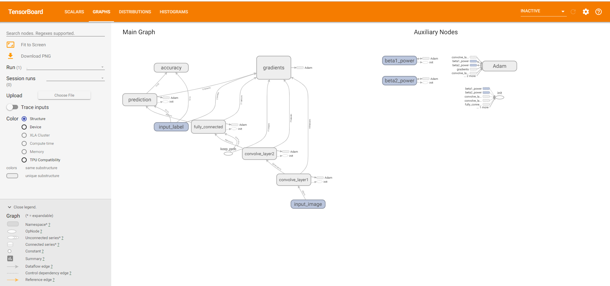

# tensorflow-CNN-mnist

## Abstract

    It's fast and convenient for me to create Convolutional Neural Networks to classify digital of mnist and analysis result by tensorboard. This paper I will talk about how to use tensorflow and tensorboard.

## Key words

    tensorflow    tensorboard    mnist   Convolutional Neural Networks

## Related work

1. Learning Basic TensorFlow Grammar
2. Learn to use tensorboard to visualize result and process

## Method

1. structured a basic CNN Model

    Follow the tutorial of tensorflow. I struct this model with two convolution layer, a fully connected layer and an output layer. Each convolution layer get one convolution which size is 5x5 and max pooling layer is 2x2

     

2. structured loss of classification

    I use Cross entropy as loss

3. visualize result

    Tensorboard provides very useful visualization tools. It got lots of interesting to viusalize result and process. I will explain all of them in my codes.

## Experiments

### data set

    MNIST

### Programming language

    Python

### Python packages

    tensorflow tensorboard

### Accuracy

    97.7%

### result

I put my visualization result in visualization you can downloard them and run them in tensorboard. I also uploaded a screenshot of my results. You can check them.

